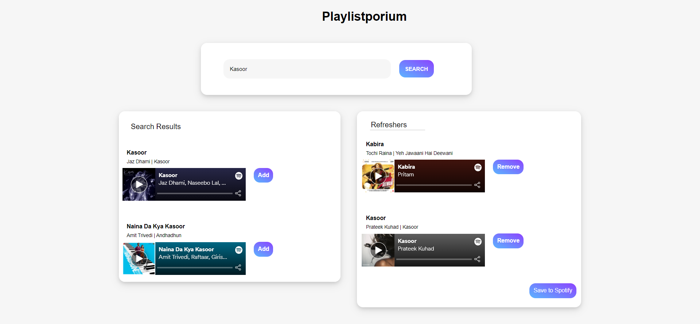

#Playlist Porium
A simple web app to create and add playlists to Spotify.

Steps to run the app:
1. Run the app using **npm start** command.
2. Give a name to your playlist. You can do it by editing the **'New Playlist'** textbox.
3. Search a song the you want to add to your playlist.
4. If you're not logged in to your Spotify account, it will redirect you to the Spotify login.
5. Once you're logged in you can search for songs, play them on the go and add them to your new playlist. 
6. You can view the song added to the playlist and remove the song from the playlist. 
7. Once you're ready with a playlist, click on **Save to Spotify** button to save your playlist.

You'll have a playlist created on Spotify!